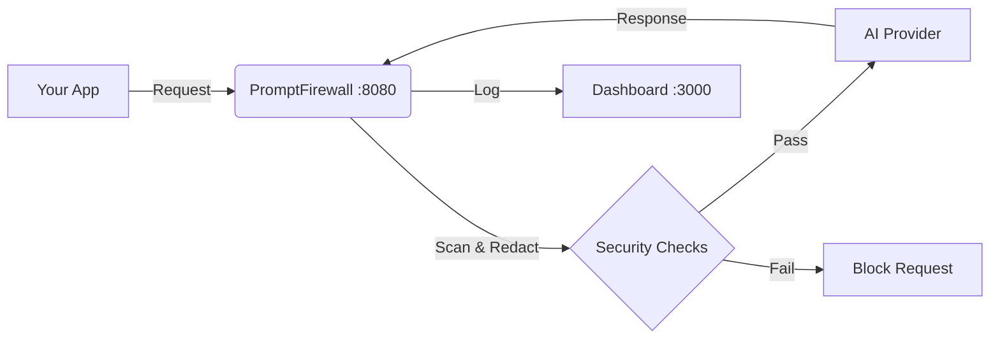

# 🛡️ PromptFirewall
> **The Ultimate Local Security Proxy for AI API Calls**

[](LICENSE)
[](docker-compose.yml)
[](proxy/)
[](dashboard/)
[](https://github.com/AcerThyRacer/PromptFirewall/pulls)

**PromptFirewall** sits between your application and AI providers (OpenAI, Anthropic, Ollama, etc.). It intercepts every request to detect PII, block prompt injections, enforce budgets, and give you complete visibility into your AI traffic.

---

## 🌟 Why It's Special

Most AI integrations are "black boxes"—you send data and hope for the best. **PromptFirewall changes that.**

*   **🕵️‍♂️ Invisible Shield:** It catches sensitive data (PII) *before* it leaves your network.
*   **💸 Budget Enforcer:** Stops runaway costs with strict daily/weekly limits.
*   **🛡️ Injection Defense:** Detects malicious attempts to jailbreak your AI models.
*   **📊 Real-time Insight:** Watch your AI traffic live, like a network firewall but for LLMs.
*   **🚀 Zero Latency:** Built with high-performance Python async and Next.js for instant feedback.

---

## 📚 Table of Contents

[🚀 Quick Start](#-quick-start) &nbsp;&nbsp;|&nbsp;&nbsp; [🔧 Installation](#-installation) &nbsp;&nbsp;|&nbsp;&nbsp; [📖 Usage Guide](#-usage-guide) &nbsp;&nbsp;|&nbsp;&nbsp; [✨ Features](#-features) &nbsp;&nbsp;|&nbsp;&nbsp; [🏗️ Architecture](#-architecture)

---

## 🚀 Quick Start

The fastest way to get started is with Docker. You can be up and running in **one command**.

### 1-Line Setup (Recommended)

If you have Docker installed, just run:

```bash
docker compose up --build
```

That's it! The system will start automatically.

-   **Dashboard:** [http://localhost:3000](http://localhost:3000)
-   **Proxy Address:** `http://localhost:8080`

---

## 🔧 Installation

### Option 1: Docker (Easiest)
Prerequisites: [Docker Desktop](https://www.docker.com/products/docker-desktop/)

1.  Clone the repository:
    ```bash
    git clone https://github.com/AcerThyRacer/PromptFirewall.git
    cd PromptFirewall
    ```
2.  Start the services:
    ```bash
    docker compose up --build
    ```

### Option 2: From Source (For Developers)
Prerequisites: Python 3.10+, Node.js 18+

**1. Start the Backend (Proxy)**
```bash
cd proxy
pip install -r requirements.txt
python server.py
# Proxy runs on http://localhost:8080
```

**2. Start the Frontend (Dashboard)**
```bash
# Open a new terminal
cd dashboard
npm install
npm run dev
# Dashboard runs on http://localhost:3000
```

---

## 📖 Usage Guide

How to actually use PromptFirewall with your code.

### Step 1: Point Your App to the Firewall

Instead of sending requests directly to OpenAI or Anthropic, you send them to `localhost:8080`.

**Python (OpenAI SDK):**
```python
from openai import OpenAI

client = OpenAI(
    base_url="http://localhost:8080/v1",  # <--- POINT TO FIREWALL
    api_key="sk-..."                       # Your actual OpenAI Key
)

# The firewall will intercept this, scan it, and forward it to OpenAI
response = client.chat.completions.create(
    model="gpt-4",
    messages=[{"role": "user", "content": "Hello!"}]
)
```

**Node.js (OpenAI SDK):**
```javascript
import OpenAI from 'openai';

const openai = new OpenAI({
  baseURL: 'http://localhost:8080/v1', // <--- POINT TO FIREWALL
  apiKey: 'sk-...'                     // Your actual OpenAI Key
});

const chatCompletion = await openai.chat.completions.create({
  messages: [{ role: 'user', content: 'Hello!' }],
  model: 'gpt-4',
});
```

**cURL:**
```bash
curl http://localhost:8080/v1/chat/completions \
  -H "Content-Type: application/json" \
  -H "Authorization: Bearer sk-..." \
  -d '{
    "model": "gpt-4",
    "messages": [{"role": "user", "content": "Hello!"}]
  }'
```

### Step 2: Monitor in Dashboard

Open [http://localhost:3000](http://localhost:3000). You will see:
*   **Live Traffic:** Requests appearing in real-time.
*   **Threats:** Any blocked PII or injections.
*   **Costs:** Estimated spend tracking.

---

## ✨ Features

| Feature | Description |
| :--- | :--- |
| **🔍 PII Detection** | Automatically detects and redacts emails, phone numbers, SSNs, credit cards, and IPs. |
| **🛡️ Injection Defense** | Blocks 20+ common prompt injection patterns (e.g., "Ignore previous instructions"). |
| **💰 Budget Control** | Set daily/weekly spend limits. Blocks requests if budget is exceeded. |
| **🌐 Multi-Provider** | Works with OpenAI, Anthropic, Google Gemini, Ollama, Mistral, and more. |
| **🔔 Webhooks** | Get notified via webhook when a threat is detected or budget is hit. |
| **🚦 Access Control** | Allow/Block specific models or endpoints. |
| **🎨 10 Themes** | Customize your dashboard with Cyberpunk, Hacker, Dracula, and more themes. |

---

## 🏗️ Architecture



---

## 📄 License

This project is licensed under the **GNU General Public License v3.0**. See the [LICENSE](LICENSE) file for details.

Copyright (c) 2026 PromptFirewall Contributors.
